# Working with Optimizely Forms

The Optimizely CMS JavaScript SDK includes built-in support for Optimizely Forms, enabling
you to model, fetch, and render forms in your headless applications.

> [!IMPORTANT] Forms support requires that Optimizely Forms is enabled in your CMS
> instance. Log in to the CMS, navigate to **Settings > Forms Settings**, and click
> **Activate**. The SDK detects this automatically — there is no configuration flag.

> [!WARNING] **The SDK does not submit form entries to Optimizely.** By default
> `FormWrapper` POSTs the form's `FormData` to whatever URL the editor put in the
> container's **Submit URL** field, and treats any `response.ok` as success. You are
> responsible for the endpoint that receives it and for storing or forwarding the data.
> The route in the Alloy template only logs the submission; the Stride one forwards it,
> see [Posting through your own server](#posting-through-your-own-server). To send it
> yourself instead — a server action, JSON, a third-party SDK — see
> [Submitting from code](#submitting-from-code).

## Quick Start

Rendering forms takes two things, done once each:

1. **In code** — write a component for the container and for each field type, then
   register them with `initForms`. Steps 1 to 4 below.
2. **In the CMS** — editors author each form and place it on a page. No further code is
   needed per form. See [Creating a form in the CMS](#creating-a-form-in-the-cms).

If you are using the Alloy or Stride template, step 1 is already done and you can go
straight to the CMS.

### 1. Set up form components

Register your form components with the SDK so the CMS can render them:

```tsx
// src/app/layout.tsx
import { initForms } from '@optimizely/cms-sdk/react/server';
import FormContainer from '@/components/forms/FormContainer';
import FormInput from '@/components/forms/FormInput';
import FormSubmit from '@/components/forms/FormSubmit';

initForms({
  container: FormContainer,
  textbox: FormInput,
  submit: FormSubmit,
});
```

### 2. Create FormContainer component

The FormContainer is the root component that wraps all form content. It uses
`FormSubmissionProvider` to manage submission state, and `FormWrapper` to orchestrate
validation and submission:

```tsx
// src/components/forms/FormContainer.tsx
import { OptiFormsContainerContentType } from '@optimizely/cms-sdk';
import { OptimizelyGridSection } from '@optimizely/cms-sdk/react/server';
import {
  FormSubmissionProvider,
  FormStep,
  FormWrapper,
  isFormButtonNode,
  partitionFormNodes,
} from '@optimizely/cms-sdk/forms/react';
import FormAlerts from './FormAlerts';
import GridRow from './GridRow';
import GridColumn from './GridColumn';

export default function FormContainer({
  content,
}: {
  content: OptiFormsContainerContentType;
}) {
  const nodes = content.nodes ?? [];
  const stepNodes = nodes.filter(node => !isFormButtonNode(node));

  return (
    <FormSubmissionProvider>
      <div id='form-alert' className='max-w-2xl space-y-5'>
        {content.Title && <h2>{content.Title}</h2>}
        {content.Description && <p>{content.Description}</p>}

        <FormAlerts submitConfirmationMessage={content.SubmitConfirmationMessage} />

        <FormWrapper
          scrollToOnSuccess='form-alert'
          scrollToOnError={false}
          action={content.SubmitUrl?.default ?? ''}
          steps={stepNodes}
          rules={content.DependencyRules}
        >
          {stepNodes.map((node, index) => {
            // Editors place Next, Previous and Submit wherever they like, often
            // each in its own row. Lifting them out lets you lay them out as one
            // footer regardless of how the form was authored.
            const step = partitionFormNodes([node]);

            return (
              // `node` makes the step selectable in the CMS editor.
              <FormStep key={node.key} index={index} node={node}>
                <OptimizelyGridSection
                  nodes={step.content}
                  row={GridRow}
                  column={GridColumn}
                />
                {step.buttons.length > 0 && (
                  <div className='mt-6 flex items-center justify-end gap-3'>
                    <OptimizelyGridSection
                      nodes={step.buttons}
                      row={GridRow}
                      column={GridColumn}
                    />
                  </div>
                )}
              </FormStep>
            );
          })}
        </FormWrapper>
      </div>
    </FormSubmissionProvider>
  );
}
```

### 3. Create field components

Field components render individual form inputs with validation and error display. Pass the
element's `content` to `useFormField` and it derives the field name, validators and
initial value for you, and hands back the props to spread:

```tsx
// src/components/forms/FormInput.tsx
'use client';

import { FormElement, useFormField } from '@optimizely/cms-sdk/forms/react';
import {
  getHtmlValidationAttributes,
  toValidators,
} from '@optimizely/cms-sdk/forms/validation';

export default function FormInput({ content }) {
  const { fieldProps, errorProps, errors, showErrors, isRequired } = useFormField({
    content,
  });

  const htmlAttrs = getHtmlValidationAttributes(toValidators(content.Validators));

  return (
    // Hides the field while a dependency rule turns it off.
    <FormElement content={content}>
      <div>
        <label htmlFor={fieldProps.id}>
          {content.Label}
          {isRequired && <span className='text-red-600'>*</span>}
        </label>
        <input
          {...fieldProps}
          type={(htmlAttrs.type as string) ?? 'text'}
          placeholder={content.Placeholder ?? ''}
        />
        {showErrors && (
          <div {...errorProps} className='text-red-600'>
            {errors.map(e => (
              <p key={e}>{e}</p>
            ))}
          </div>
        )}
      </div>
    </FormElement>
  );
}
```

`fieldProps` carries the ref, `id`, `name`, `value`, `required`, `aria-invalid`,
`aria-describedby`, `onChange` and `onBlur`. `errorProps` carries the matching `id` and
`role="alert"`. Spreading both keeps the accessibility wiring consistent across every
field type.

To let editors click a label or placeholder and edit it in the CMS, add preview attributes
— see [Editing in the CMS](#editing-in-the-cms). The footer above aligns its buttons with
`justify-end`, which is deliberate: aligning them individually with `ml-auto` works for a
visitor but not in edit mode, for the reason explained in the same section.

For a control that cannot take those directly — a radio group, where the name and change
handler belong on each radio and the ref on the fieldset — use `inputRef`, `value`,
`setValue`, `onBlur` and `errorId` instead.

### 4. Create alerts component

The alerts component shows success or error messages based on form submission state:

```tsx
// src/components/forms/FormAlerts.tsx
'use client';

import { useFormSubmission } from '@optimizely/cms-sdk/forms/react';

export default function FormAlerts({ submitConfirmationMessage }) {
  const { formSuccess, formError } = useFormSubmission();
  if (!formSuccess && !formError) return null;

  return (
    <>
      {formSuccess && (
        <div className='bg-green-100 text-green-800 p-4 rounded'>
          {submitConfirmationMessage || 'Thank you! Your form has been submitted.'}
        </div>
      )}
      {formError && (
        <div className='bg-red-100 text-red-800 p-4 rounded'>
          Sorry, there was an error. Please try again.
        </div>
      )}
    </>
  );
}
```

### 5. Add forms in the CMS

With the components registered, everything else happens in the CMS — no further code is
needed for each new form. See [Creating a form in the CMS](#creating-a-form-in-the-cms).

---

## Creating a form in the CMS

Once the components above are registered, editors author forms in the CMS and your
application renders them automatically — you do not write code for each new form. This
section covers only what affects the SDK; for the editor interface itself, see the
Optimizely Forms product documentation.

### How a form is structured

A form is a **shared block** of type _Form Container_, laid out like a section: the
container holds one or more **steps**, each step holds **rows** and **columns**, and the
elements sit inside the columns.

```text
Form Container          the shared block
└── Form Step           at least one, even in a single-step form
    └── Row
        └── Column
            └── Textbox / Selection / Submit button / ...
```

This is the shape `FormStep` and `partitionFormNodes` work with, and it is
why a single-step form still has a step in it. A container with no step, or fields placed
outside one, renders as a title with no fields.

### Building a form, step by step

This walks through a newsletter sign-up form: a name, an email address and a submit
button. It assumes `initForms()` has already run in your app — until it does, the form
content types are not registered and none of the types below appear in the CMS.

1. Create a **shared block**, search the content type list for **Form Container**, and
   name it `Newsletter sign-up`.

   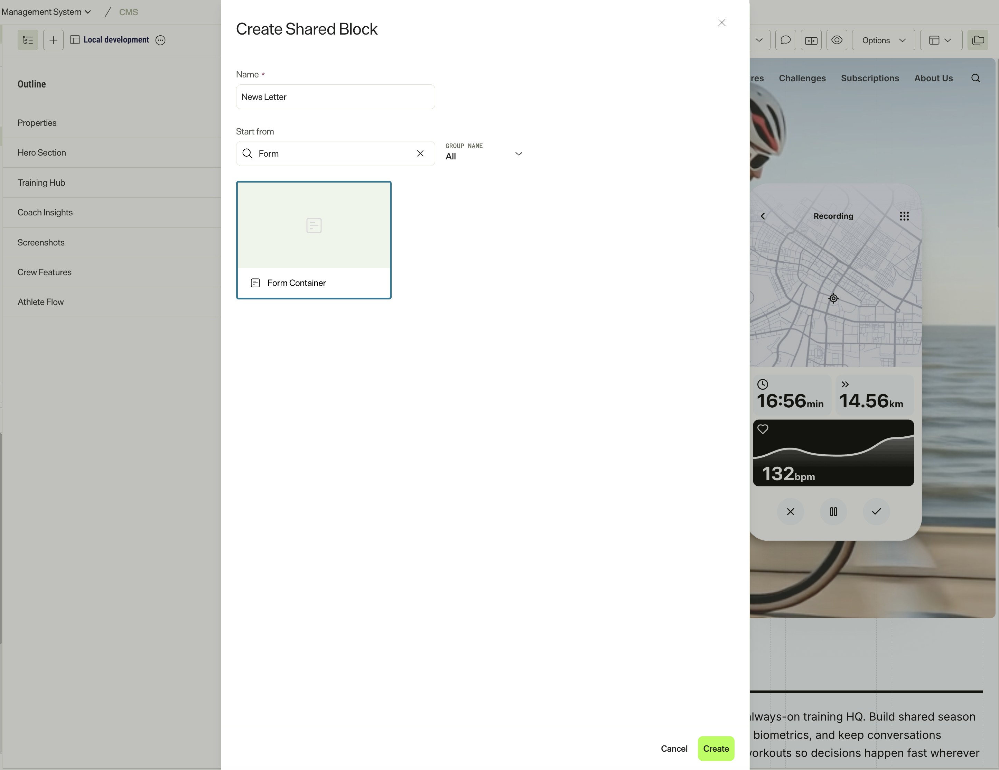

2. Open the block and add a **Form Step** with the **+** button. Every form needs at
   least one, including a single-step form.

   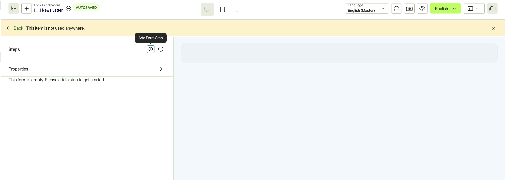

3. Inside the step, add a **row** and a **column**, the same way you would in a
   composition or an experience. Elements live in columns, not directly in the step.

   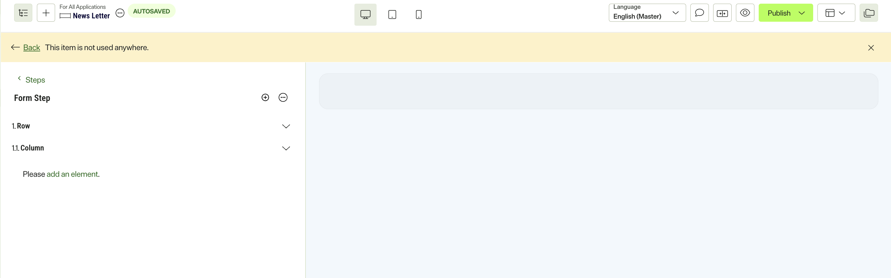

4. Add an element to the column. The picker shows only form elements — Textbox,
   Textarea, Number, Range, URL, Selection, Multiple or single choice, Submit button and
   Reset button.

   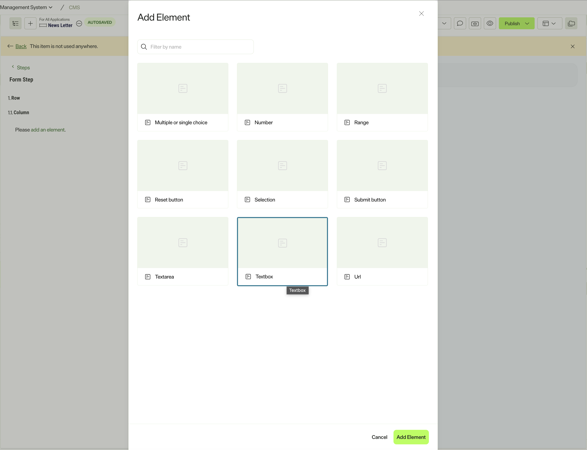

5. Add a **Textbox** for the visitor's name and fill in its properties:

   | Property              | Value                                  |
   | --------------------- | -------------------------------------- |
   | `Label`               | `Name` — what the visitor sees         |
   | `Placeholder`         | Optional hint text inside the field    |
   | `SubmissionFieldName` | `name` — the key in the submitted data |
   | `Validators`          | Tick **Required**                      |

   `SubmissionFieldName` falls back to the label when you leave it empty, so a field
   labelled `Name` submits as `Name`. Set it explicitly when your endpoint expects a
   particular key.

   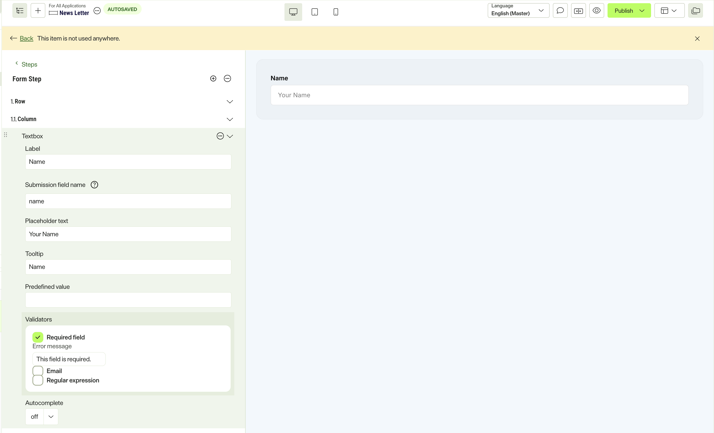

6. Add a second **Textbox** for the email address, labelled `Email` with
   `SubmissionFieldName` set to `email`. There is no "email" property on the element —
   email is a **validator**. In `Validators`, tick both **Email** and **Required**: the
   email validator only checks what was typed, so on its own it accepts an empty field.

   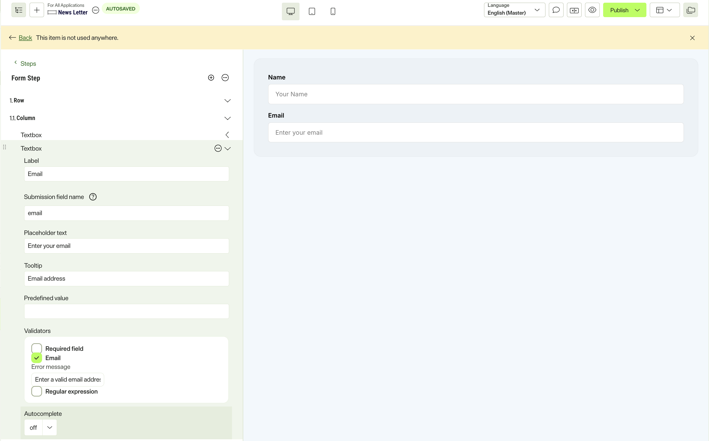

7. Add another row and column, and put a **Submit button** in it.

   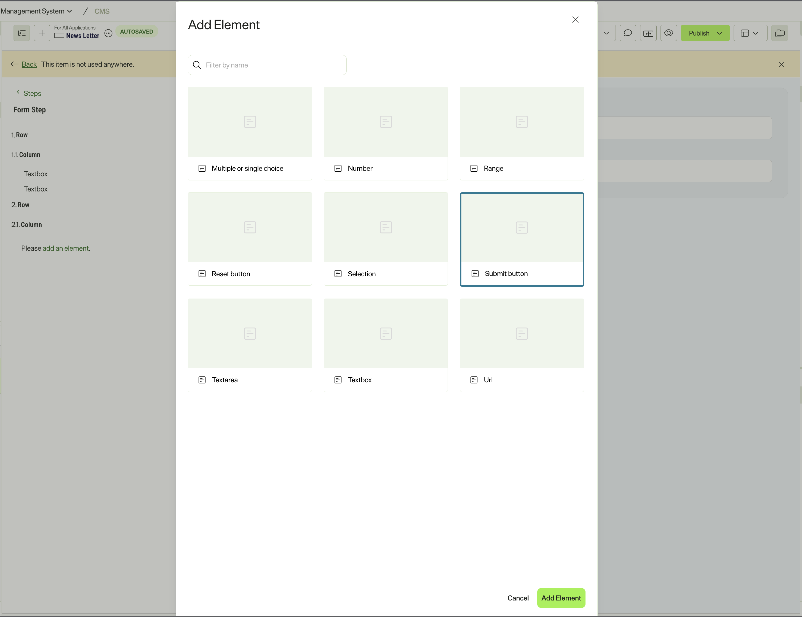

   It has just two properties, `Label` and `Tooltip`, but the label matters: `Next`,
   `Previous` and `Back` are reserved for step navigation. A button labelled `Next` moves
   to the next step instead of submitting. Use `Subscribe`, `Sign up` or anything else
   that is not a navigation word.

   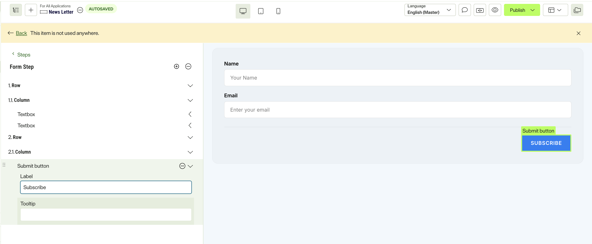

8. Go back to the container's own properties and set **Submit URL** to the absolute URL
   of your newsletter endpoint. Leave it empty and the form posts to its own page, which
   answers `405` — see [The Submit URL](#the-submit-url).

   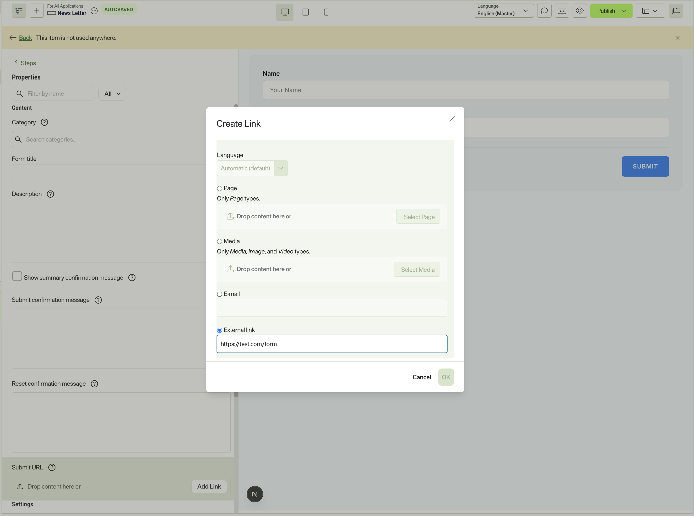

9. **Publish** the block. Nothing renders until you do — a draft container is not
   returned by the published query your site runs.

10. Place the published block. There are two routes, and they behave differently:

    **In an experience**, drag it in as a **section**. The container is declared with
    `compositionBehaviors: ['sectionEnabled']`, so it slots in at section level, beside
    your other sections, and needs no extra setup.

    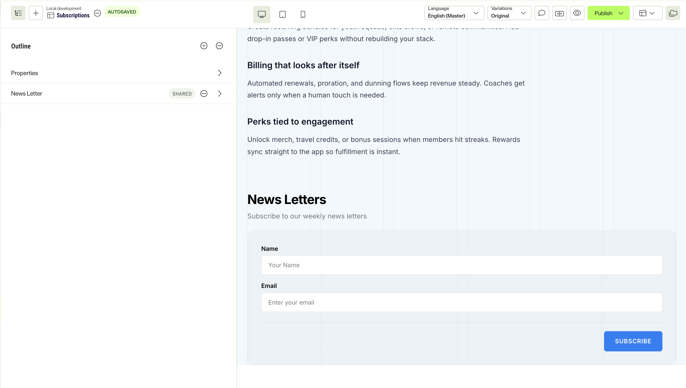

    **In a content area**, pick it the way you would any other shared block — but the
    area's `allowedTypes` (or `restrictedTypes`) has to admit the container. If it does
    not, the block still appears in the CMS and still renders its title, while its fields
    are never fetched and the form comes out empty. See
    [How form fragments are fetched](#how-form-fragments-are-fetched).

    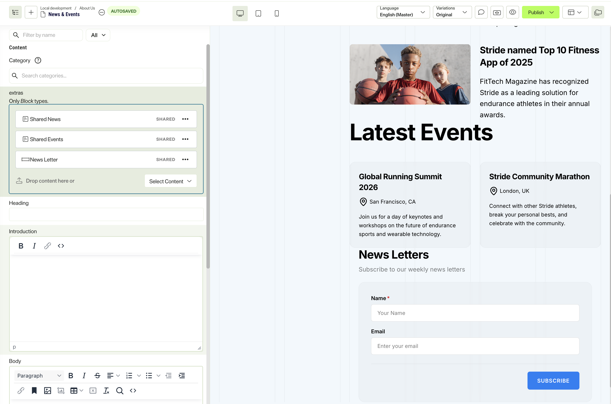

    To bind a form to one specific page type instead, give the page a `component`
    property typed to the container — see
    [Using Forms in Content Models](#using-forms-in-content-models).

#### Making it multi-step

Adding a second **Form Step** at step 2 is all it takes. The SDK then shows one step at a
time, keeps the values entered on the others, and adds the navigation — `Next` on the
first step, `Previous` and `Next` in the middle, `Previous` plus the submit button on the
last.

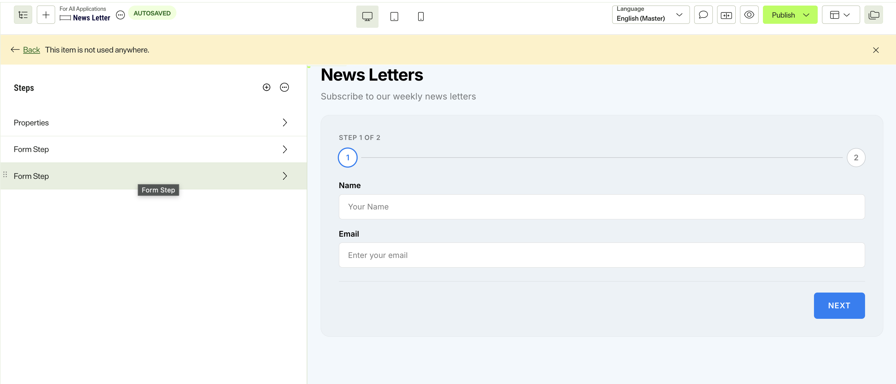

See [Adding steps](#adding-steps) for what advancing validates, and
[Branching between steps](#branching-between-steps) for skipping or jumping between them.

### What to get right

Five things trip people up, because none of them fail loudly:

|                           |                                                                                                                                                                                                             |
| ------------------------- | ----------------------------------------------------------------------------------------------------------------------------------------------------------------------------------------------------------- |
| **Submit URL**            | Where the submission goes. Leave it empty and the form posts to its own page, which answers `405`. See [The Submit URL](#the-submit-url).                                                                   |
| **Submission field name** | The key the field uses in the submitted data. Falls back to the label, so set it when your endpoint expects a particular name.                                                                              |
| **Validators combine**    | An email validator alone accepts an empty field; it only checks what was typed. Add a required validator too.                                                                                               |
| **Step button labels**    | Label them `Next` and `Previous` — or `Back`, which also goes backwards. Matching ignores case and surrounding whitespace, but not spelling: any other label is treated as submit, so a mislabelled button sends a half-filled form. |
| **Where you place it**    | A content area's `allowedTypes` (or `restrictedTypes`) must admit the container, or its fields are never fetched — see [How form fragments are fetched](#how-form-fragments-are-fetched). A composition works with no extra setup. |

### Container properties

Besides its steps, the container carries the form's settings. The SDK fetches all of them
and hands them to your component, but it only acts on two: `DependencyRules`, which it
reads through `FormWrapper`, and `SubmitUrl`, which reaches it as `action`. **The rest are
text for you to render.** Nothing displays them on your behalf.

| Property                            | Holds                                         | Acted on by                                               |
| ----------------------------------- | --------------------------------------------- | --------------------------------------------------------- |
| `Title`, `Description`              | Heading and intro text                        | Your container, if it renders them                        |
| `SubmitUrl`                         | Where the submission goes                     | `FormWrapper`, via `action` — see below                   |
| `DependencyRules`                   | Show, hide, skip and jump rules               | `FormWrapper`, via `rules`                                |
| `SubmitConfirmationMessage`         | Thank-you text for a successful submit        | Nothing. Both templates pass it to their alerts component |
| `ResetConfirmationMessage`          | Text for a reset form                         | Nothing at all                                            |
| `ShowSummaryMessageAfterSubmission` | Whether to show a summary instead of the form | Nothing at all                                            |

The last two are worth knowing about, because they fail silently in the CMS: an editor can
fill either one in, save, and see no effect anywhere. If your form needs them, read them
off `content` and render them yourself — `useFormSubmission()` tells you when a submit has
succeeded, which is the moment both describe:

```tsx
const { formSuccess } = useFormSubmission();

if (formSuccess && content.ShowSummaryMessageAfterSubmission) {
  return <p>{content.SubmitConfirmationMessage}</p>;
}
```

`SubmitConfirmationMessage` is in the same position — the SDK does not render it, the
templates do. The Quick Start's `FormAlerts` shows the pattern: take the message as a prop
and fall back to your own wording when the editor left it empty.

### The Submit URL

Every form container has a **Submit URL** property, set by the editor, naming where the
submission is sent. It is the one piece of the form whose value your code has to read
rather than render, so it is worth knowing its shape.

It is a URL property, not a string. The address an editor typed arrives as `default`:

```json
{
  "type": "EXTERNAL",
  "default": "https://hooks.example.com/forms",
  "hierarchical": null,
  "internal": null,
  "graph": null,
  "base": null
}
```

Which is why the container component reads `content.SubmitUrl?.default` and passes it as
`action`. The other fields are populated for URLs pointing at CMS content, not for the
external endpoint a form normally posts to:

```tsx
action={content.SubmitUrl?.default ?? ''}
```

Three things about the value itself:

**Give an absolute URL.** `https://example.com/leads`, not `/api/leads`. The browser would
resolve a relative path, but a proxy route resolves it server-side where there is no page
to be relative to, and Node's `fetch` rejects it outright.

**Do not point it at your proxy route.** If you forward submissions through your own
server, the Submit URL is the _final_ destination, not the forwarder. Pointing it at the
forwarder makes the route call itself with a body it does not recognise — the second call
answers `400`, which the first turns into a `502`. The form reports a generic failure and
nothing in the browser explains why. See
[Posting through your own server](#posting-through-your-own-server).

**Empty is not neutral.** An unset Submit URL leaves `action` as `''`, which posts to the
current page and gets a `405`. `FormWrapper` logs a development warning when it has
neither an `action` nor a `submitHandler`.

An editor changing this field changes where live submissions go, with no deployment and no
code review. If that matters for your instance, take the destination out of their hands —
ignore `action` and hardcode it in a `submitHandler`, or validate it server-side before
forwarding.

### Adding steps

Add a second **Form Step** and the SDK shows one at a time, keeping values entered on the
others. Each step carries its own navigation buttons: `Next` on the first, `Previous` and
`Next` in the middle, `Previous` plus a submit button on the last.

Advancing validates only the step on screen. Submitting validates every step and jumps to
the one holding the first invalid field. For the rendering side, see
[Multi-Step Forms](#multi-step-forms).

Steps need not run front to back. A dependency rule can hide a step or send the visitor
to a chosen one — see [Branching between steps](#branching-between-steps).

---

## Form Validation

Validators are set on each field in the CMS. `useFormField` reads them from `content` and
handles the checking, error messages and field registration — the Quick Start field
component above already has everything needed.

Errors appear once the field has been blurred or the form submitted, so a visitor is not
told a field is invalid before they have had a chance to fill it in. Validators are
independent: an email validator accepts an empty field, so pair it with a required
validator.

Supported validators:

| Validator                    | Checks                     |
| ---------------------------- | -------------------------- |
| `requirevalidator`           | A value was entered        |
| `emailvalidator`             | Email format               |
| `integervalidator`           | Integer, negatives allowed |
| `positiveintegervalidator`   | Positive integer           |
| `decimalvalidator`           | Decimal number             |
| `urlvalidator`               | Valid URL                  |
| `regularexpressionvalidator` | A custom pattern           |

The underlying patterns are exported if you need them elsewhere:

```ts
import { VALIDATION_PATTERNS } from '@optimizely/cms-sdk/forms/validation';

// email, integer, positiveInteger, decimal
VALIDATION_PATTERNS.email.test(value);
```

---

## Form Dependency Rules

Show and hide fields based on other fields' values. Rules come from the container and are
passed to `FormWrapper` once, as shown in the Quick Start:

```tsx
<FormWrapper action={...} rules={content.DependencyRules}>
```

Each field component then needs two things:

1. Wrap its markup in `FormElement`, which renders nothing for a visitor while a rule
   hides the field.
2. Pass `content` to `useFormField`, which reports the field's value so rules that depend
   on it can be evaluated. No manual `setFieldValue()` calls are needed.

```tsx
export default function FormInput({ content }) {
  const { fieldProps } = useFormField({ content });

  return (
    <FormElement content={content}>
      <input {...fieldProps} />
    </FormElement>
  );
}
```

`FormElement` must wrap the markup **inside** the field component, not the component
itself. A hidden field is excluded from validation, and `useFormField` can only do that
from inside. Wrapping from outside leaves a hidden required field registered, blocking
submission with no visible error.

A rule can target a button as readily as a field — "show Submit once Email is filled in"
is a common one — so the Submit and Reset components need the same `FormElement` wrapper.
They take no part in validation, so that is all they need:

```tsx
export default function FormSubmit({ content }) {
  const { buttonProps, label } = useFormButton(content);

  return (
    <FormElement content={content}>
      <button {...buttonProps}>{label}</button>
    </FormElement>
  );
}
```

A hidden field is rendered anyway while editing in the CMS. A rule describes what a
visitor sees, and an editor still has to be able to find the field to change it —
otherwise the CMS shows an empty, selectable block with no indication of what it is.

### Rule Conditions

Supported comparison operators:

| Operator                 | Checks                                    |
| ------------------------ | ----------------------------------------- |
| `Equals`                 | Exact match                               |
| `NotEquals`              | Anything but an exact match               |
| `Contains`               | Value contains the comparison text        |
| `NotContains`            | Value does not contain it                 |
| `StartsWith`             | Value begins with it                      |
| `EndsWith`               | Value ends with it                        |
| `MatchRegularExpression` | Value matches it as a pattern             |

An unparseable pattern fails the condition rather than throwing. An unrecognised
operator is treated as unsatisfied, so a rule the SDK cannot read leaves its target
visible rather than hiding it.

Combining conditions: `All` (AND), `Any` (OR).

### Rule Actions

A rule's `SatisfiedAction` decides what it does when its conditions hold:

| Action                | Applies to               | Effect                                        |
| --------------------- | ------------------------ | --------------------------------------------- |
| `Show` / `Hide`        | `TargetElement`          | A field or button appears or disappears        |
| `ShowStep` / `HideStep` | `TargetStep`             | A whole step is shown or skipped               |
| `JumpToStep`           | `AfterStep` → `JumpToStep` | Next goes to a chosen step instead of the next one |

`Hide` wins over `Show` when both target the same element, and an element no rule
matches is always visible.

Step actions need no work in your components — `FormWrapper` reads them from the same
`rules` prop. See [Branching between steps](#branching-between-steps).

---

## Multi-Step Forms

This section covers the rendering side. For authoring one in the CMS — adding steps and
labelling their buttons — see [Adding steps](#adding-steps).

Use `FormStep` to render one step at a time, as shown in the Quick Start container.
Inactive steps stay mounted behind `display: none`, so values survive stepping back and
forth and submitting validates every step, not just the visible one.

Advancing validates only the current step. Submitting validates all of them, and jumps to
the step holding the first invalid field so the visitor can see what is blocking them.

### Step buttons

Optimizely Forms has no property marking a button as step navigation: Next, Previous and
Submit are all the same element type, distinguished **only by their label**.
`useFormButton` resolves the role and wires it up:

```tsx
'use client';

import { useFormButton } from '@optimizely/cms-sdk/forms/react';

export default function FormSubmit({ content }) {
  const { role, label, isSubmitting, buttonProps } = useFormButton(content);

  return (
    <button {...buttonProps} className={role === 'previous' ? 'secondary' : 'primary'}>
      {isSubmitting ? 'Submitting…' : label}
    </button>
  );
}
```

`role` is `'next'`, `'previous'`, `'submit'` or `'reset'`. `buttonProps` sets the right
`type`, the click handler, `disabled` while the request is in flight, and the tooltip.

The labels matched are `next` for forward and `previous` or `back` for backward, compared
case-insensitively after trimming. For a form authored in another language, pass your own:

```tsx
useFormButton(content, { labels: { next: ['nästa'], previous: ['tillbaka'] } });
```

Your labels replace the defaults for whichever direction you give, so include the English
ones too if a form might use either. To settle the question yourself — a Reset element,
say, which is never navigation — pass the role outright and skip label matching:

```tsx
useFormButton(content, { role: 'reset' });
```

### Branching between steps

Dependency rules can reorder the walk through a form as well as hide fields within it.
Both are read from the same `rules` prop, and both need `steps` so `FormWrapper` can match
a rule's step key to a rendered step — the Quick Start container already passes both:

```tsx
<FormWrapper steps={stepNodes} rules={content.DependencyRules}>
```

Nothing is needed in your step or field components. Pressing Next then resolves in order:

1. A satisfied `JumpToStep` rule whose `AfterStep` is the current step wins, and the form
   goes straight there. An unresolvable target is ignored and the walk continues below.
2. Otherwise the form advances, skipping any step a `HideStep` rule is hiding or a
   `ShowStep` rule has not yet revealed.

Previous retraces the steps actually visited rather than counting back one, so a jump is
undone by the button that follows it. The trail is cleared on a successful submit and on
a form reset.

The last step is never skipped, whatever its rules say — a form has to end somewhere, and
a visitor stranded past the final step has no way to submit.

Rules only steer the walk; they do not change validation. Submitting still validates every
step, including ones skipped on the way, so a hidden step holding a required field blocks
the form. Hide the fields inside it as well as the step itself, and `useFormField`
unregisters them — see [Form Dependency Rules](#form-dependency-rules).

### After a successful submit

The fields are cleared and the form returns to the first step. Because the inputs are
controlled by `useFormField`, this is driven by the SDK rather than by `form.reset()`,
which only clears uncontrolled inputs.

---

## Editing in the CMS

### Selecting a block

Every component the SDK renders is wrapped in a `data-epi-block-id` marker while in edit
mode, so form elements, rows and columns are selectable without you doing anything. Pass
the step's node to `FormStep` to make the step selectable too:

```tsx
<FormStep index={index} node={node}>
```

### Editing a property

Property markers are yours to add, because only your component knows which element shows
which property. Field components run on the client, so import the helper from
`forms/react` — `react/server` pulls in server components and cannot be imported from a
`'use client'` file:

```tsx
'use client';

import { getPreviewUtils, useFormField } from '@optimizely/cms-sdk/forms/react';

export default function FormInput({ content }) {
  const { fieldProps } = useFormField({ content });
  const { pa } = getPreviewUtils(content);

  return (
    <label htmlFor={fieldProps.id} {...pa('Label')}>
      {content.Label}
    </label>
  );
}
```

`pa` returns an empty object outside edit mode, so it is safe to spread unconditionally.

**CSS that depends on a component being a direct child breaks in edit mode.** The marker
div sits between the parent and your component, so it becomes the flex or grid item
instead — `ml-auto`, `first:`, `last:`, `space-x-*` and sibling selectors all stop
working. Let the container decide the layout instead: for a row of buttons, put
`justify-between` or `justify-end` on the wrapper.

`getFormButtonRole` answers "is one of these a back button" without React, so a server
component can make that choice:

```tsx
import { getFormButtonRole } from '@optimizely/cms-sdk/forms/react';

const goesBack = nodes.some(n => getFormButtonRole(n.component ?? {}) === 'previous');
```

### Previewing a form on its own

A form container is a shared block, so the CMS can preview it outside any page. That works
the same way as a page: the SDK fetches the section's own composition, and its steps
arrive on `content.nodes` exactly as they do when the form sits on a page. No separate
code path is needed in your container component.

If a form renders with its title but no fields, the container's nodes were not fetched.
See [How form fragments are fetched](#how-form-fragments-are-fetched).

---

## Advanced Topics

### Available Content Types

`initForms` registers all of these for you. Import them individually only if you need to
reference one in your own content model:

```ts
import { OptiFormsContainerDataContentType } from '@optimizely/cms-sdk';

// Available:
// - OptiFormsContainerDataContentType
// - OptiFormsTextboxElementContentType
// - OptiFormsTextareaElementContentType
// - OptiFormsNumberElementContentType
// - OptiFormsRangeElementContentType
// - OptiFormsUrlElementContentType
// - OptiFormsChoiceElementContentType
// - OptiFormsSelectionElementContentType
// - OptiFormsSubmitElementContentType
// - OptiFormsResetElementContentType
// - OptiFormsDependencyRuleContentType
// - OptiFormsConditionContentType
```

### How form fragments are fetched

Form fragments are large, so the SDK only requests them for pages that could actually
contain a form. Nothing here needs configuring — it is described because it explains the
one failure mode, a form that renders its title and no fields.

Detection is in two parts. A form placed in an experience's composition is found by a
probe on the page itself. A form in a content area is an ordinary reference that Graph
cannot filter on, so the page's **content model** is consulted instead: the SDK walks its
content properties, and the properties of the types those admit, until it finds one whose
`allowedTypes` or `restrictedTypes` resolve to include the form container. Nesting is
followed, so a form two or three types deep still counts. The walk errs towards enabling
forms — a page type that merely permits one pays for the fragments even when the
particular page has none.

That makes `_component` a convenient way to admit a container, since it is declared
`_component` with `sectionEnabled`, but it is not the only one — naming the container
type, or leaving a property open, works as well:

```ts
extras: {
  type: 'array',
  items: {
    type: 'content',
    allowedTypes: ['_component'],
  },
},
```

Fetching is also two parts, because Graph only resolves a section's `composition` when
that section is the content being asked for. A container reached through a content area
therefore arrives with no steps, and the SDK follows up with one extra request per form to
fetch them. Containers are found at any depth in the response and grouped by key, so the
same shared form placed twice on a page costs one request, not two. A form in a
composition, or previewed on its own, arrives complete and costs nothing extra.

A container still renders with no fields if its own content model was never registered —
`initForms` has to have run — or if it genuinely has no steps. The templates log a
development warning in that case.

### Using Forms in Content Models

```ts
import { contentType } from '@optimizely/cms-sdk';
import { OptiFormsContainerDataContentType } from '@optimizely/cms-sdk';

export const PageWithFormContentType = contentType({
  key: 'PageWithForm',
  baseType: '_page',
  properties: {
    title: { type: 'string', displayName: 'Page Title' },
    form: {
      type: 'component',
      displayName: 'Contact Form',
      contentType: OptiFormsContainerDataContentType,
    },
  },
});
```

### FormWrapper Props

```tsx
<FormWrapper
  action='/api/submit' // Optional: endpoint for the built-in POST
  submitHandler={sendLead} // Optional: send it yourself instead
  scrollToOnSuccess='element-id' // Optional: scroll on success
  scrollToOnError='element-id' // Optional: scroll on error
  steps={stepNodes} // Optional: multi-step form nodes
  rules={dependencyRules} // Optional: visibility rules
>
  {children}
</FormWrapper>
```

One of `action` or `submitHandler` is needed. With neither, the form posts to the page it
is on, which answers `405`; the SDK logs a development warning when that happens.

### Submitting from code

`submitHandler` replaces the built-in POST. The form still validates first, and on success
still clears its fields and returns to the first step. **Resolve means success, throw
means failure** — and a thrown `Error`'s message reaches
`useFormSubmission().errorMessage`, so an API can explain itself rather than the visitor
seeing a generic failure.

```tsx
<FormWrapper
  submitHandler={async formData => {
    const response = await fetch('/api/leads', {
      method: 'POST',
      headers: { 'Content-Type': 'application/json' },
      body: JSON.stringify(Object.fromEntries(formData)),
    });

    // A 200 carrying a rejection is still a failure.
    const result = await response.json();
    if (!result.ok) throw new Error(result.message);
  }}
  steps={stepNodes}
>
  {children}
</FormWrapper>
```

A server action works the same way: `submitHandler={saveLead}`. The handler also receives
the container's Submit URL as `context.action`, so one handler can serve forms with
different destinations.

Note that `submitHandler` runs in the browser, so anything needing a credential belongs in
a server action or a route handler called from it.

### Posting through your own server

A Submit URL pointing at another origin is a cross-origin POST, and the browser blocks the
response unless that endpoint sends CORS headers back. For a webhook you do not control,
that is not something you can fix at the endpoint.

`createJsonSubmitHandler` routes the submission through your own app instead. It turns the
`FormData` into JSON and POSTs `{ targetUrl, payload, formKey }` to a same-origin route,
which forwards it server-side where CORS does not apply:

```tsx
'use client';

import { createJsonSubmitHandler, FormWrapper } from '@optimizely/cms-sdk/forms/react';

<FormWrapper submitHandler={createJsonSubmitHandler('/api/forms/submit')} {...props} />;
```

`targetUrl` is the container's Submit URL, so the route stays generic and the editor keeps
control of where a given form goes. Pass a second argument to label the form —
`createJsonSubmitHandler('/api/forms/submit', content._metadata.key)` — and it arrives as
`formKey`. Fields sharing a name arrive as an array. A non-`ok` response throws, which the
form reports as a failure.

The matching route is a forwarder:

```ts
// app/api/forms/submit/route.ts
export async function POST(request: NextRequest) {
  const { targetUrl, payload } = await request.json();
  if (!targetUrl) return NextResponse.json({ error: 'Missing targetUrl' }, { status: 400 });

  const response = await fetch(targetUrl, {
    method: 'POST',
    headers: { 'Content-Type': 'application/json' },
    body: JSON.stringify(payload),
  });

  return new NextResponse(null, { status: response.ok ? 200 : 502 });
}
```

The Stride template ships exactly this. Alloy instead leaves `FormWrapper` to POST the raw
`FormData` to the Submit URL, and its route only logs what arrives.

> [!WARNING] The route above forwards to whatever URL the request names, so anyone who
> finds it can use your server to POST to any host. Because `targetUrl` comes from content
> an editor authored rather than from the visitor, check it before forwarding — an
> allowlist of hosts you expect, or reading the Submit URL from the form's own content
> server-side rather than trusting the body.

### useFormSubmission API

```ts
const {
  formSuccess, // Boolean: the last submit succeeded
  formError, // Boolean: the last submit failed
  isSubmitting, // Boolean: a submit is in flight
  errorMessage, // Message from a throwing `submitHandler`, else undefined
  error, // Whatever that handler threw
  status, // 'idle' | 'submitting' | 'success' | 'error'
  setStatus, // Drive the state yourself: setStatus(status, error?)
} = useFormSubmission();
```

The three booleans cover most components. `status` is the same state as one value, useful
for a switch. `setStatus` is there for a container that submits outside `FormWrapper` —
pass an `Error` alongside `'error'` to surface its message as `errorMessage`.

### useFormField API

```ts
const {
  fieldProps,   // Spread onto an <input> or <textarea>
  errorProps,   // Spread onto the element listing the messages
  value,        // Current input value
  setValue,     // Update value
  inputRef,     // Attach to the element to scroll to and focus
  onBlur,       // Marks the field touched, so errors can show
  errorId,      // id of the error element, or undefined when not showing
  errors,       // Array of error messages
  showErrors,   // Boolean: errors should be displayed now
  hasErrors,    // Boolean: field has validation errors
  isRequired,   // Boolean: field is required
  isVisible,    // Boolean: false while a dependency rule hides the field
} = useFormField({
  content: fieldContent,  // Name, validators and initial value are read from this
  name: 'fieldName',      // Optional: overrides SubmissionFieldName / Label
  validators: [...],      // Optional: overrides the Validators property
  defaultValue: '',       // Optional: overrides PredefinedValue
});
```

Pass a type parameter when the ref is not an `<input>`:

```ts
useFormField<HTMLTextAreaElement>({ content });
```

### Validation Utilities

```ts
import {
  validateField, // Validate value against validators
  getErrorMessages, // Extract error messages
  isFieldRequired, // Check if field is required
  getHtmlValidationAttributes, // Generate HTML5 attributes
  extractErrorMessage, // Get single validator message
  extractValidatorType, // Get normalized validator type
  getFieldName, // Get field display name
  toValidators, // Read a field's `Validators` property into a Validator[]
  getSelectionOptions, // Read a choice or selection field's `Options` property
  VALIDATION_PATTERNS, // Regex patterns: email, integer, etc.
} from '@optimizely/cms-sdk/forms/validation';
```

### Advanced: Custom Rule Evaluation

```ts
import { useFormRules } from '@optimizely/cms-sdk/forms/react';

const {
  rules, // The container's DependencyRules, as given to FormWrapper
  fieldValues, // Current value of every field a rule can depend on
  setFieldValue, // Report a value yourself; useFormField already does
  isElementVisible, // Is this field or button shown? (Show / Hide)
  isStepVisible, // Is this step shown? (ShowStep / HideStep)
  getJumpTarget, // Step key a satisfied JumpToStep rule points to, else null
} = useFormRules();

// Check if element should be visible
const visible = isElementVisible(elementId);
```

Every one of these takes or returns an element's **key**, not its label; `getElementId`
derives it from a piece of content. They accept an array of keys as well as one, because a
node can be named by its composition key or its content key and a rule may use either.

`FormWrapper` already calls `isStepVisible` and `getJumpTarget`, so reach for them only
when driving the steps yourself. Outside a `FormWrapper` the hook returns inert defaults —
everything visible, no jumps — rather than throwing.

### Component Setup Options

```tsx
// Simple setup (recommended)
initForms({
  container: FormContainer,
  textbox: FormInput,
  submit: FormSubmit,
});

// With tagged variants
initForms({
  container: {
    default: DefaultContainer,
    tags: { compact: CompactContainer },
  },
});
```

`initForms` registers the form content types and their components. It can be called before
or after `initContentTypeRegistry` and `initReactComponentRegistry`, works alongside a
resolver function as well as a component map, and is safe to call more than once — a hot
reload will not register anything twice.

Handlers you leave out render a development-only placeholder, so you can add field types
as you need them. The available keys are `container`, `textbox`, `textarea`, `number`,
`range`, `url`, `choice`, `selection`, `submit` and `reset`.

---

## Troubleshooting

| Symptom                             | Likely cause                                                                                                                                                                          |
| ----------------------------------- | ------------------------------------------------------------------------------------------------------------------------------------------------------------------------------------- |
| **Title renders, no fields**        | `initForms` never ran, or the container genuinely has no step. Steps are fetched at any depth, so nesting is not the cause. See [How form fragments are fetched](#how-form-fragments-are-fetched). |
| **Nothing renders at all**          | A component is missing from `initForms`, or a field component is missing `'use client'`. Check the browser console for resolution errors.                                             |
| **Validation never fires**          | `FormWrapper` is not wrapping the form, so there is no validation context.                                                                                                            |
| **Rules never fire**                | `FormWrapper` did not get the `rules` prop, or a component does not pass `content` to `useFormField` and `FormElement`. An element no rule can be matched to is always visible.       |
| **Step rules never fire**           | `FormWrapper` did not get `steps`, so a rule's step key cannot be matched to a rendered step. See [Branching between steps](#branching-between-steps).                                |
| **Submit does nothing**             | The blocking field is on a step that is not showing. The form moves to it — check your field components actually render their error messages.                                         |
| **Submit blocked by a hidden step** | Hiding a step does not unregister its fields. Hide the required fields inside it too, so `useFormField` drops them from validation.                                                   |
| **Submit always fails**             | Empty Submit URL posts to the page and gets a `405`. A cross-origin Submit URL without CORS headers fails the same way — see [Posting through your own server](#posting-through-your-own-server). Check the network tab. |
| **Proxy returns `502`**             | Usually the Submit URL naming the proxy route itself, so it forwards to itself and the second call answers `400`. A relative Submit URL throws instead, since server-side `fetch` needs an absolute one. See [The Submit URL](#the-submit-url). |
| **A step button submits**           | Its label is not one the SDK matches. `Next`, `Previous` and `Back` are matched; anything else is a submit. Pass `labels` or `role` to `useFormButton`.                               |
| **Buttons misplaced while editing** | Layout depending on a direct-child relationship; the CMS marker div sits in between. See [Editing in the CMS](#editing-in-the-cms).                                                   |
